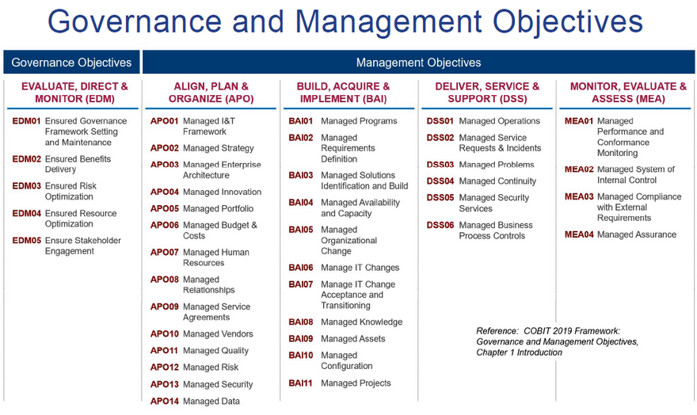
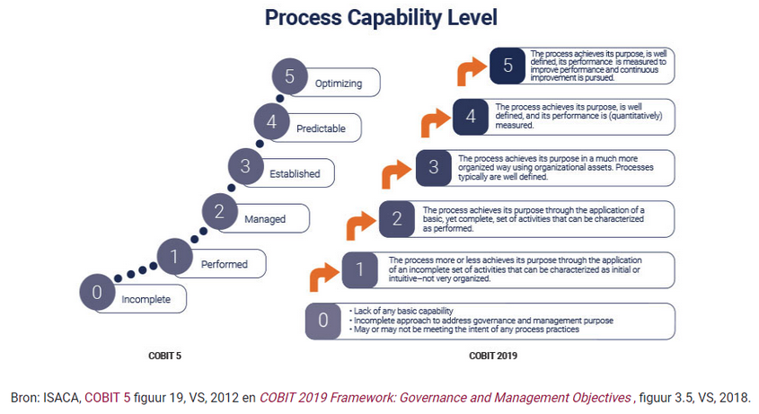
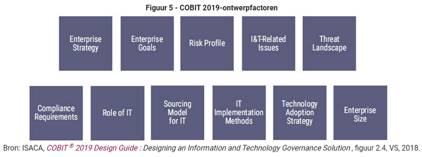
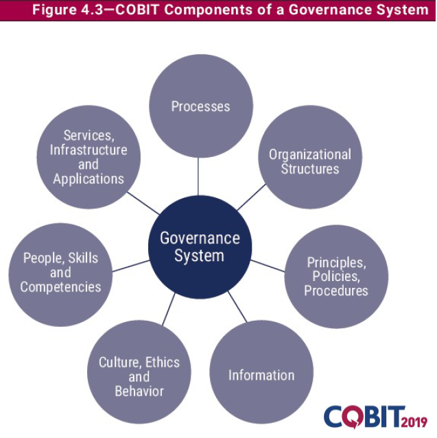

# COBIT

In dit document wordt op een korte, maar krachtige en begrijpelijk manier uitgelegd wat COBIT voor standaard/framework is. 

  

* ## Wat is dit voor standaard/framework?

    COBIT is een framework wat als eerst vrijgegeven is door ISACA in 1996. In de daaropvolgende jaren, zijn er meerdere versies uitgekomen. Op het moment van het schrijven in dit document, is de laatste versie: COBIT 2019. Deze versie bouwt voort op voorgaande versies. 

    Volgens COBIT, is dit framework een breed en alomvattend framework dat is ontwikkeld om begrip, ontwerp en implementatie van het beheer en de governance van enterprise IT te ondersteunen (IT Management Group, 2020)
    
    COBIT zie je veel terug bij grote bedrijven, die in staat willen zijn om te voldoen aan de regelgeving. Het is niet concreet, maar legt de best practices voor een globale beheersing van de IT-processen vast, zodat er sturing kan plaatsvinden. Je kan met het gebruik van COBIT, ook andere methodieken gebruiken zoals: ITIL, ASL en PRINCE2. Deze zijn specifieker, maar overlappen wel deels met COBIT 2019. 

    COBIT 2019 heeft 40 processen en focust zich voornamelijk op security, risk management en information governance. Er zijn meer management processen (35), dan governance processen (5). 
    
    **Hieronder worden de processen afgebeeld:**

    
    (IT Management Group, 2020)
    
    **Per proces, worden er capaciteits- en volwassenheidsniveaus gemeten op een van 0 tot 5:**

    
    (IT Management Group, 2020)

    Een groot verschil met COBIT 5 (de vorige versie) is dat COBIT 2019 ontwerpfactoren heeft. Je kan hiermee het ontwerp van het COBIT governance systeem op maat maken. 

    **Dit zijn de volgende ontwerpfactoren:**

    
    (IT Management Group, 2020)
 

* ## Hoe draagt dit bij aan governance van cloudprocessen, componenten, services, business en de mensen die ermee werken?

    COBIT heeft een vijftal processen, waarbij aandacht wordt besteed aan 'governance'. Elk proces zal hieronder in de tabel worden toegelicht met de desbetreffende bijdrage. Dit past ook prima in een cloud context. 

    Referentie   |             Naam                |      Doel/nut
    ------------ | ------------- | -------------
    EDM01 | Ensured governance framework setting and maintenance | Een consistente aanpak om beslissingen af te stemmen op de strategie van het bedrijf. Bekijk of de processen effectief, transparant en voldoet aan de compliancy. 
    EDM02 | Ensured benefits delivery | Dit proces wordt gebruikt voor een optimale waarde van initiatieven, services en middelen.
    EDM03 | Ensured risk optimization | Risico's worden hier geminimaliseerd.
    EDM04 | Ensured resource optimization | Middelen worden gebruikt op een 'optimale' manier, zodat er hier veel voordeel uit kan worden gehaald. Sta open voor verandering.
    EDM05 | Ensured stakeholder engagement | Betrek stakeholders bij je strategy & road map. Communicatie met de stakeholders is noodzakelijk, om prestaties te verhogen. Probeer ook naar verbeteringen op bepaalde gebieden te kijken. 
    
     

    **Redenen om COBIT te implementeren (Pink Elephant, 2020):**

    * Verbeteren of implementeren IT Governance
    * IT dienstverlening verder laten aansluiten bij de organisatiedoelstellingen
    * Overnames en fusies, uniformering van processen
    * Standaardiseren en automatiseren van IT processen
    * Voldoen aan wet- en regelgeving (SOX, WFT, WBP, MIFID, Basel II)
    * Outsourcing
    * Beheersbaar krijgen van IT kosten
    * Implementeren van IT control framework.

    Je kan uit bovenstaande punten halen, dat het zich ook focust op 'governance'. 

    **Een governance system ziet er voor COBIT als volgt uit:**

    
    (IT Management Group, 2020)

 

* ## Is het compleet? Worden alle aspecten die met governance te maken hebben afgedekt?

    Doordat alle processen zo abstract zijn, kan je zelf veel invulling geven aan de manier van werken. Veel processen van COBIT worden met de governance aspecten gedekt, maar niet alles.

    COBIT is namelijk niet gericht op de techniek, maar meer op de business, processen en mensen binnen het bedrijf. Het wordt daarom ook aangeraden, om verdere invulling te geven met een andere methodiek zoals ITIL, ASL of PRINCE2.

 

* ## Wat zijn de sterke punten en wat is minder goed?

  

**Sterke punten van Cobit:**
* Risk Minimization

    Cobit helpt bedrijven met het verlagen van de risico’s van hun infrastructuur en services.

* Environment Regulation

    De laatste versie van Cobit frameworks zorgt voor compliance en maakt het voor het bedrijf veel gemakkelijker om aan te tonen dat het aan de vereisten voldoen.

* Governance

    Een ander sterk punt van Cobit is het implementeren van een IT governance standaard binnen een bedrijf. Dat zorgt ervoor dat risico’s in verband met IT worden beperkt.

**Minder sterke punten zijn:**

* Een implementatie kan soms enkele jaren duren.

* De implementatie kan lastig zijn, Binnen het bedrijf moet er veel kennis en skills aanwezig zijn.

 

* ## Wat doen de grote publieke cloudproviders met deze standaard/framework? Conformeren zij zich hieraan?

    **AWS**

    De AWS-controleomgeving onderworpen aan verschillende interne en externe risicobeoordelingen. AWS compliance en beveiliging teams hebben een raamwerk en beleid voor informatiebeveiliging opgesteld dat is gebaseerd op het raamwerk Control Objectives for Information and Related Technology (COBIT).

    **Azure**

    De certificatie scope van Azure security famework bevat het volgende:
    De HITRUST CSF bouwt voort op Health Insurance Portability en Accountability Act (HIPAA) en de Health Information Technology for Economic and Clinical Health (HITECH) Act, door een framework te bieden voor complexe compliance die technische en proceselementen omvatten, zoals HIPAA, National Institute of Standards and Technology (NIST), The Information Services Office (ISO) en Control Objectives for Information and Related Technologies (COBIT) om ervoor te zorgen dat er controles zijn om beschermde gezondheidsinformatie (PHI) te beschermen.

  

* ## Filmpje COBIT:

    [Introduction COBIT2019](https://www.youtube.com/watch?v=KJLAJSZbfIM)

 

* ## APA-vermelding

    IT Management Group. (2020, 4 oktober). COBIT Best Practice. Geraadpleegd op 24 december 2020, van https://itmg.nl/training/informatie/best-practices/cobit-best-practice/

    Pink Elephant. (2020, 9 juli). Wat is COBIT IT Governance? | Kennisbank. Geraadpleegd op 24 december 2020, van https://www.pinkelephant.nl/kennisbank/cobit/
